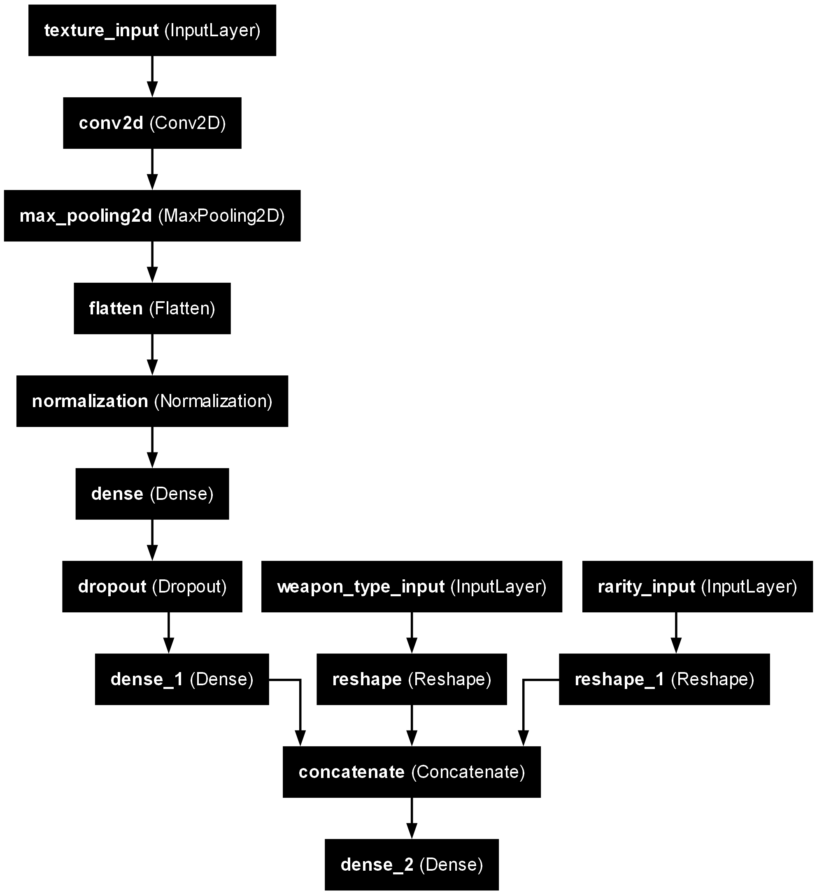

# Counter Strike Skin Value Predictor

Uses a CNN regression model written with Keras in Python 3 to attempt to predict the price of a skin on the Steam Community Market.

---
### About
The value predictor was created in Python 3, using the Tensorflow and Keras libraries. There are a few required programs, namely [GCFScape](https://developer.valvesoftware.com/wiki/GCFScape) and the [Valve Resource Format Decompiler](https://github.com/ValveResourceFormat/ValveResourceFormat). These are used in the extraction of textures and skin data from the game files. The VRF Decompiler is already located in the files, so it does not need to be installed seperately.  

GCFScape can be used to pull new files from Counter Strike following an update. For more information on this where these files are located, please refer to [Resource Locations](#resource-locations).

### Installation
All required files can be acquired by simply downloading the source code. The required python packages can be installed with `pip install -r requirements.txt`.

### Execution
The dataset can be built by running [`main.py`](./ItemScraper/main.py) in the [`ItemScraper`](./ItemScraper/) subfolder.  
The actual model can be trained by running [`cs_predictor.py`](./ModelTrainer/cs_predictor.py) in the [`ModelTrainer`](./ModelTrainer/) subfolder. 

---

### Dataset Collection
All data from the dataset is collected from the decompiled source files. These files are already be included in the downloaded data, but they can be updating existing files with the resources outlined in [Resource Locations](#resource-locations).  
  
The following steps extract the information needed to collect price data and train the model:
1. Decompile and extract information from VMATs
2. Use internal tag names from VMATs to find texture files
3. Extract wear rating data  
  
Collected data is then stored in the [skins.db](./ItemScraper/Data/) file, for later use in both dataset construction and price fetching.  
  
In order to collect prices, queries are constructed to the Steam market webpages. The base url for these requests is:

    https://steamcommunity.com/market/pricehistory/?country=US&currency=3&appid=730&market_hash_name={HASH NAME{
which uses a specific weapon, it's skin, and its lowest possible wear rating to fetch price data.
  
For example, the URL that follows will get the price data for a "factory new Ancient Earth P90" skin:

    https://steamcommunity.com/market/pricehistory/?country=US&currency=3&appid=730&market_hash_name=P90 | Ancient Earth (Factory New)

The returned data is the lifetime price history, stored in a JSON object, which can be passed to the database. By this point, all required skin data has been gathered, and the actual construction of the dataset can begin.

 There are some added constraints to this data, such as ignoring skins that do not have valid texture files, and knife skins. Since knives are consistently some of the highest priced skins on the market, and there are numerous types with numerous skins, they were left out of the dataset to avoid creating outliers and implying patterns that may not exist elsewhere. 
  
The dataset building is handled in [`cs_skin_price_data_dataset_builder.py`](./ItemScraper/cs_skin_price_data/cs_skin_price_data_dataset_builder.py), which is built off the [Tensorflow Dataset template](https://www.tensorflow.org/api_docs/python/tf/data/Dataset).  

### Model
The model is a regression model with CNN layers for pattern recognition and analysis. A CNN layer takes in the texture data, passes to a maxing pool, before passing a second CNN layer and maxing pool. Data is eventually flattened, normalized, and combined with the rarity and weapon identifier, before being extracted for output.

### Predictions
The current iteration of the model results in the following predictions for price. The scatterplot below shows the difference between the average price of the skin (taken from the market) and the predicted price of the skin (taken from the model).

As one may be able to notice, higher price skins tend to have a higher accuracy rating, while lower price skins have a much higher variability. Typically, incorrect predictions tend to be float above trend line, meaning they have a lower predicted price compared to the actual average.    

---

### Resource Locations
The data extracted from the source files can be found in the following table, with its corresponding locations. All noted resources will be contained in `{base game folder}/game/csgo/pak01_dir.vpk`, and the following table contains information on where the resource is located in the internal VPK directory structure, as seen in [GCFScape](https://developer.valvesoftware.com/wiki/GCFScape).

| Resource Name                            | Location                                                    |
|------------------------------------------|-------------------------------------------------------------|
| *[items_game.txt](./ItemScraper/Data/)*  | `/scripts/items/items_game.txt`                             |
| *[csgo_english.txt](./ItemScraper/Data)* | `/resource/csgo_english.txt`                                |
| [VMAT files](./ItemScraper/VMATs)        | `/materials/models/weapons/customization/paints/vmats/*`    |
| [skin textures](./ItemScraper/Textures)  | `/materials/models/weapons/customization/paints/*/*.vtex_c` |

VMAT and skin texture files will need to be decompiled into a human-readable format with the Valve Resource Format Decompiler.